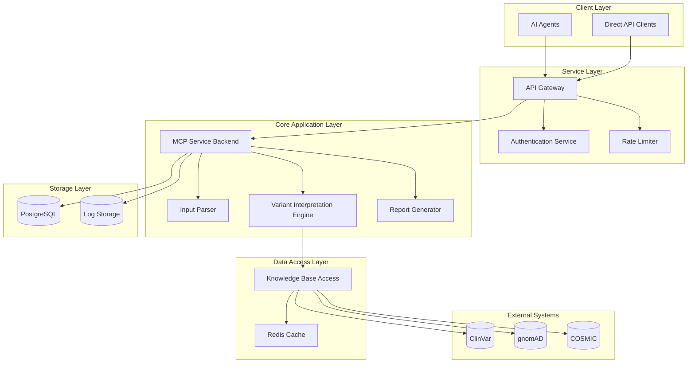

# Design Document

## Overview

The ACMG-AMP MCP Server is a high-performance Golang microservice that implements standardized genetic variant classification using ACMG/AMP guidelines. The system follows a modular architecture with clear separation of concerns, enabling scalable processing of variant interpretation requests from AI agents and direct API clients.

The service processes genetic variants through a multi-stage pipeline: input validation and parsing, evidence aggregation from multiple databases, ACMG/AMP rule application, and structured report generation. The design emphasizes reliability, performance, and clinical accuracy while maintaining compatibility with popular AI platforms.

## Architecture

### System Architecture

The system follows a layered microservice architecture with the following key components:



### Technology Stack

- **Runtime**: Go 1.21+
- **Web Framework**: Gin (for HTTP routing and middleware)
- **Database**: PostgreSQL (for persistent storage)
- **Cache**: Redis (for external API response caching)
- **Configuration**: Viper (for configuration management)
- **Logging**: Logrus with structured logging
- **Testing**: Go standard testing + Testify
- **Documentation**: Swagger/OpenAPI 3.0
- **Containerization**: Docker with multi-stage builds

## Components and Interfaces

### 1. API Gateway Component

**Purpose**: Entry point for all requests, handles authentication, rate limiting, and request routing.

**Key Interfaces**:
```go
type APIGateway interface {
    HandleVariantInterpretation(ctx context.Context, req *VariantRequest) (*VariantResponse, error)
    ValidateAPIKey(apiKey string) (*Client, error)
    ApplyRateLimit(clientID string) error
}

type VariantRequest struct {
    VariantID     string            `json:"variant_id"`
    HGVSNotation  string            `json:"hgvs_notation"`
    VariantType   VariantType       `json:"variant_type"` // GERMLINE, SOMATIC
    GeneSymbol    string            `json:"gene_symbol"`
    Transcript    string            `json:"transcript,omitempty"`
    ClientContext map[string]string `json:"client_context,omitempty"`
}

type VariantResponse struct {
    VariantID      string                 `json:"variant_id"`
    Classification ClassificationResult   `json:"classification"`
    Evidence       []EvidenceItem        `json:"evidence"`
    Report         InterpretationReport  `json:"report"`
    ProcessingTime time.Duration         `json:"processing_time"`
    Timestamp      time.Time             `json:"timestamp"`
}
```

### 2. Input Parser Component

**Purpose**: Validates and standardizes variant nomenclature, ensuring consistent input format.

**Key Interfaces**:
```go
type InputParser interface {
    ParseVariant(input string) (*StandardizedVariant, error)
    ValidateHGVS(hgvs string) error
    NormalizeVariant(variant *StandardizedVariant) error
}

type StandardizedVariant struct {
    Chromosome    string      `json:"chromosome"`
    Position      int64       `json:"position"`
    Reference     string      `json:"reference"`
    Alternative   string      `json:"alternative"`
    HGVSGenomic   string      `json:"hgvs_genomic"`
    HGVSCoding    string      `json:"hgvs_coding,omitempty"`
    HGVSProtein   string      `json:"hgvs_protein,omitempty"`
    GeneSymbol    string      `json:"gene_symbol"`
    TranscriptID  string      `json:"transcript_id,omitempty"`
    VariantType   VariantType `json:"variant_type"`
}
```

### 3. Variant Interpretation Engine

**Purpose**: Core component that applies ACMG/AMP guidelines and determines variant classification.

**Key Interfaces**:
```go
type InterpretationEngine interface {
    ClassifyVariant(ctx context.Context, variant *StandardizedVariant, evidence *AggregatedEvidence) (*ClassificationResult, error)
    ApplyACMGAMPRules(evidence *AggregatedEvidence) (*RuleApplication, error)
    DetermineClassification(rules *RuleApplication) Classification
}

type ClassificationResult struct {
    Classification   Classification    `json:"classification"`
    Confidence      ConfidenceLevel   `json:"confidence"`
    AppliedRules    []ACMGAMPRule    `json:"applied_rules"`
    RulesSummary    string           `json:"rules_summary"`
    Recommendations []string         `json:"recommendations,omitempty"`
}

type ACMGAMPRule struct {
    Code        string         `json:"code"`        // e.g., "PVS1", "PS1"
    Category    RuleCategory   `json:"category"`    // PATHOGENIC, BENIGN
    Strength    RuleStrength   `json:"strength"`    // VERY_STRONG, STRONG, MODERATE, SUPPORTING
    Met         bool           `json:"met"`
    Evidence    string         `json:"evidence"`
    Rationale   string         `json:"rationale"`
}
```

### 4. Knowledge Base Access Component

**Purpose**: Manages connections to external databases and aggregates evidence for variant interpretation.

**Key Interfaces**:
```go
type KnowledgeBaseAccess interface {
    GatherEvidence(ctx context.Context, variant *StandardizedVariant) (*AggregatedEvidence, error)
    QueryClinVar(variant *StandardizedVariant) (*ClinVarData, error)
    QueryGnomAD(variant *StandardizedVariant) (*PopulationData, error)
    QueryCOSMIC(variant *StandardizedVariant) (*SomaticData, error)
}

type AggregatedEvidence struct {
    ClinicalSignificance *ClinVarData     `json:"clinical_significance,omitempty"`
    PopulationFrequency  *PopulationData  `json:"population_frequency,omitempty"`
    SomaticEvidence      *SomaticData     `json:"somatic_evidence,omitempty"`
    ComputationalData    *PredictionData  `json:"computational_data,omitempty"`
    FunctionalData       *FunctionalData  `json:"functional_data,omitempty"`
    SegregationData      *SegregationData `json:"segregation_data,omitempty"`
}
```

### 5. Report Generator Component

**Purpose**: Formats classification results into structured reports for different client types.

**Key Interfaces**:
```go
type ReportGenerator interface {
    GenerateReport(result *ClassificationResult, variant *StandardizedVariant) (*InterpretationReport, error)
    FormatForAIAgent(report *InterpretationReport) (string, error)
    GeneratePDFReport(report *InterpretationReport) ([]byte, error)
}

type InterpretationReport struct {
    Summary          string              `json:"summary"`
    Classification   Classification      `json:"classification"`
    EvidenceSummary  []EvidenceSummary  `json:"evidence_summary"`
    Recommendations  []string           `json:"recommendations"`
    Limitations      []string           `json:"limitations"`
    References       []Reference        `json:"references"`
    GeneratedAt      time.Time          `json:"generated_at"`
}
```

## Data Models

### Core Enums and Types

```go
type Classification string
const (
    PATHOGENIC        Classification = "PATHOGENIC"
    LIKELY_PATHOGENIC Classification = "LIKELY_PATHOGENIC"
    VUS              Classification = "VUS"
    LIKELY_BENIGN    Classification = "LIKELY_BENIGN"
    BENIGN           Classification = "BENIGN"
)

type VariantType string
const (
    GERMLINE VariantType = "GERMLINE"
    SOMATIC  VariantType = "SOMATIC"
)

type RuleStrength string
const (
    VERY_STRONG RuleStrength = "VERY_STRONG"
    STRONG      RuleStrength = "STRONG"
    MODERATE    RuleStrength = "MODERATE"
    SUPPORTING  RuleStrength = "SUPPORTING"
)
```

### Database Schema

**variants table**:
```sql
CREATE TABLE variants (
    id UUID PRIMARY KEY DEFAULT gen_random_uuid(),
    hgvs_notation VARCHAR(255) NOT NULL,
    chromosome VARCHAR(10) NOT NULL,
    position BIGINT NOT NULL,
    reference VARCHAR(1000) NOT NULL,
    alternative VARCHAR(1000) NOT NULL,
    gene_symbol VARCHAR(50),
    variant_type VARCHAR(20) NOT NULL,
    created_at TIMESTAMP DEFAULT NOW(),
    updated_at TIMESTAMP DEFAULT NOW()
);
```

**interpretations table**:
```sql
CREATE TABLE interpretations (
    id UUID PRIMARY KEY DEFAULT gen_random_uuid(),
    variant_id UUID REFERENCES variants(id),
    classification VARCHAR(20) NOT NULL,
    confidence_level VARCHAR(20) NOT NULL,
    applied_rules JSONB NOT NULL,
    evidence_summary JSONB NOT NULL,
    report_data JSONB NOT NULL,
    processing_time_ms INTEGER NOT NULL,
    created_at TIMESTAMP DEFAULT NOW()
);
```

## Error Handling

### Error Types and Handling Strategy

```go
type MCPError struct {
    Code       string    `json:"code"`
    Message    string    `json:"message"`
    Details    string    `json:"details,omitempty"`
    Timestamp  time.Time `json:"timestamp"`
    RequestID  string    `json:"request_id"`
}

// Error Categories
const (
    ErrInvalidInput     = "INVALID_INPUT"
    ErrDatabaseError    = "DATABASE_ERROR"
    ErrExternalAPI      = "EXTERNAL_API_ERROR"
    ErrClassification   = "CLASSIFICATION_ERROR"
    ErrRateLimit        = "RATE_LIMIT_EXCEEDED"
    ErrAuthentication   = "AUTHENTICATION_ERROR"
    ErrInternalServer   = "INTERNAL_SERVER_ERROR"
)
```

### Error Handling Patterns

1. **Input Validation Errors**: Return 400 Bad Request with specific validation messages
2. **External API Failures**: Implement circuit breaker pattern with fallback to cached data
3. **Database Errors**: Use connection pooling with retry logic and graceful degradation
4. **Classification Uncertainties**: Return VUS classification with detailed uncertainty explanations

## Testing Strategy

### Unit Testing
- **Coverage Target**: 90%+ code coverage
- **Test Structure**: Table-driven tests for rule application logic
- **Mocking**: Mock external database connections and HTTP clients
- **Test Data**: Curated set of known variants with expected classifications

### Integration Testing
- **Database Integration**: Test with real PostgreSQL instance using test containers
- **External API Integration**: Test with sandbox/staging environments where available
- **End-to-End Workflows**: Test complete variant interpretation pipelines

### Performance Testing
- **Load Testing**: Support for 100 concurrent requests with <2s response time
- **Stress Testing**: Graceful degradation under high load
- **Database Performance**: Query optimization for large variant datasets

### Clinical Validation Testing
- **Known Variant Testing**: Validate against ClinVar expert-reviewed variants
- **Benchmark Datasets**: Test against published ACMG/AMP validation sets
- **Edge Case Testing**: Handle ambiguous and complex variant scenarios

## Security Considerations

### Authentication and Authorization
- API key-based authentication for client identification
- Rate limiting per client to prevent abuse
- Request/response logging for audit trails

### Data Protection
- No storage of patient-identifiable information
- Encryption in transit (TLS 1.3)
- Secure configuration management for database credentials

### Input Validation
- Strict HGVS notation validation to prevent injection attacks
- Request size limits to prevent DoS attacks
- Sanitization of all user inputs before database queries

## Performance and Scalability

### Caching Strategy
- Redis caching for external database responses (TTL: 24 hours)
- In-memory caching for ACMG/AMP rule definitions
- Response caching for identical variant requests

### Database Optimization
- Indexed queries on chromosome, position, and gene symbol
- Connection pooling with configurable pool sizes
- Read replicas for reporting and analytics queries

### Horizontal Scaling
- Stateless service design for easy horizontal scaling
- Load balancer support with health check endpoints
- Container orchestration ready (Kubernetes compatible)