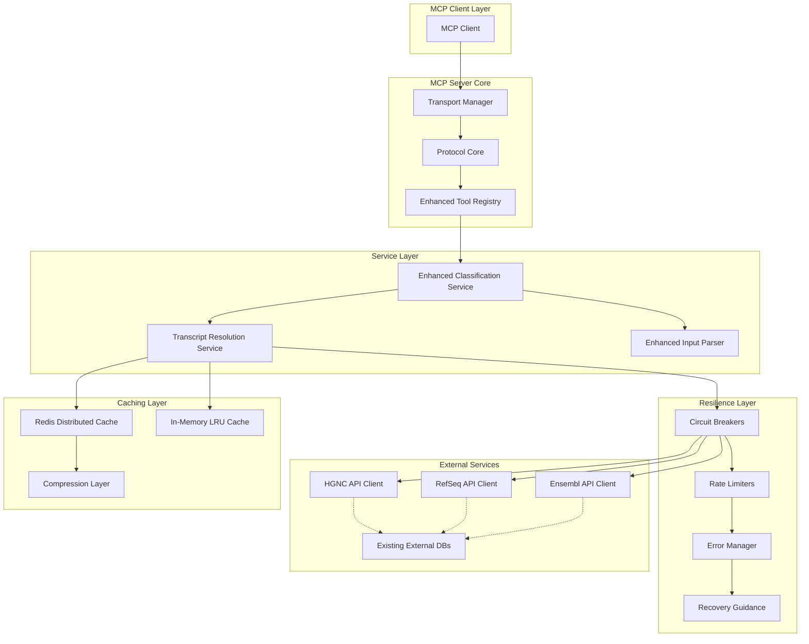
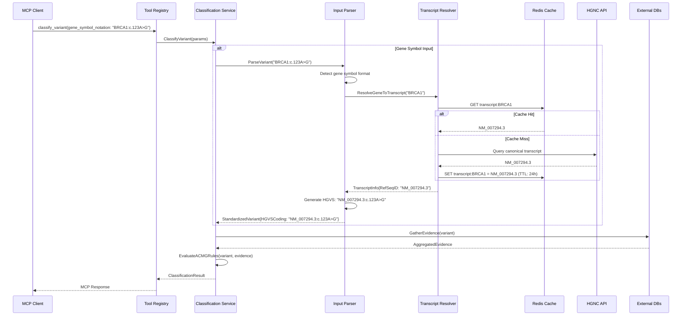
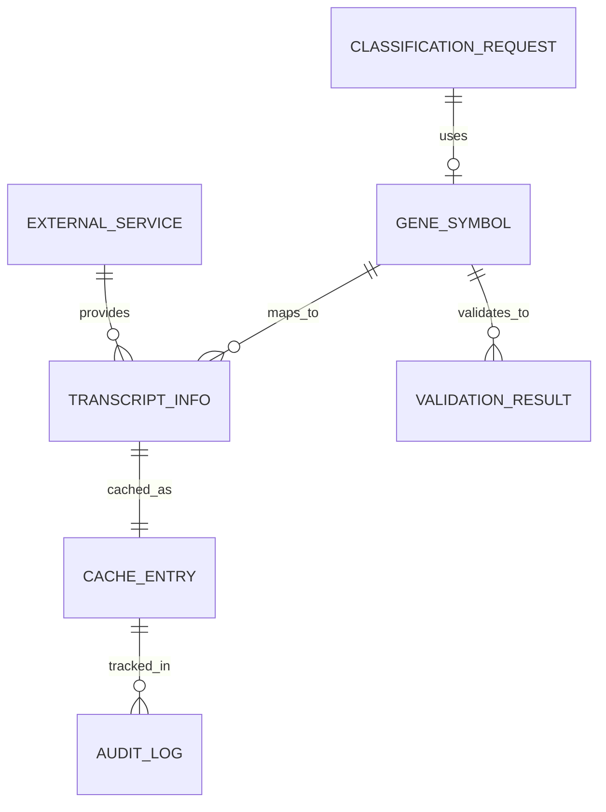

# Technical Design

## Overview

This design implements gene symbol-based variant classification as an alternative to RefSeq HGVS notation, leveraging the existing sophisticated MCP architecture with distributed caching, circuit breaker patterns, and comprehensive error handling. The solution maintains full backward compatibility while extending classification capabilities to support human-readable gene symbols like "BRCA1" and "TP53".

## Requirements Mapping

### Design Component Traceability
Each design component addresses specific EARS requirements:

- **Enhanced Input Parser** → 1.1-1.5: Gene symbol input processing and validation
- **Transcript Resolution Service** → 2.1-2.5: Automatic gene-to-RefSeq mapping with caching
- **MCP Tool Parameter Enhancement** → 3.1-3.5: Tool interface extension with validation
- **External Gene Mapping APIs** → 6.1-6.5: HGNC, RefSeq, and Ensembl integration
- **Classification Service Integration** → 4.1-4.5: Accuracy and consistency maintenance
- **Multi-level Caching Strategy** → 7.1-7.5: Performance optimization with Redis and in-memory caches
- **Comprehensive Error Handling** → 5.1-5.5: User guidance and recovery mechanisms
- **Backward Compatibility Layer** → 8.1-8.5: Seamless integration with existing workflows

### User Story Coverage
- **Clinical Geneticist**: Enhanced input parser accepts gene symbols, automatic transcript resolution
- **Research Scientist**: Batch processing support, concurrent transcript resolution, performance optimization
- **AI Agent Developer**: Extended MCP tool interface with validation and error handling
- **Laboratory Technician**: Comprehensive error messages with suggestions and recovery guidance
- **System Administrator**: Resilient external service integration with circuit breakers and monitoring
- **Existing MCP Client Developer**: Full backward compatibility with existing tool contracts

## Architecture



### Technology Stack
Based on extensive research of current MCP patterns and Go medical software standards:

- **Backend**: Go 1.21+ with `github.com/modelcontextprotocol/go-sdk`
- **Caching**: Redis 7.0+ for distributed caching, in-memory LRU for hot data
- **Resilience**: `github.com/sony/gobreaker` circuit breaker pattern
- **External APIs**: HGNC REST API, RefSeq E-utilities, Ensembl REST API
- **Logging**: `github.com/sirupsen/logrus` with structured JSON logging
- **Validation**: Custom HUGO gene nomenclature validation
- **Compression**: Built-in Go compression for cached responses
- **Monitoring**: Prometheus-compatible metrics and health checks

### Architecture Decision Rationale

- **Why Circuit Breaker Pattern**: Existing architecture uses `gobreaker` for resilient external service calls, ensuring consistent patterns
- **Why Redis + In-Memory Cache**: Current caching strategy uses two-tier approach for optimal performance and distribution
- **Why Enhanced Input Parser**: Extends existing `StandardInputParser` maintaining backward compatibility while adding gene symbol support
- **Why Transcript Resolution Service**: Dedicated service allows caching, rate limiting, and failover independently of classification logic
- **Why Multiple External APIs**: HGNC as authoritative source, RefSeq/Ensembl as fallbacks for resilience

### Data Flow

#### Gene Symbol Classification Flow


## Components and Interfaces

### Backend Services & Method Signatures

#### Enhanced Input Parser
```go
type EnhancedInputParser struct {
    hgvsPattern       *regexp.Regexp
    geneSymbolPattern *regexp.Regexp
    transcriptResolver TranscriptResolver
    geneValidator     *GeneValidator
}

// Core parsing methods
func (p *EnhancedInputParser) ParseVariant(input string) (*domain.StandardizedVariant, error)
func (p *EnhancedInputParser) parseGeneSymbolVariant(input string) (*domain.StandardizedVariant, error)
func (p *EnhancedInputParser) parseGeneWithVariant(gene, seqType, variation string) (*domain.StandardizedVariant, error)
func (p *EnhancedInputParser) generateHGVSFromGeneSymbol(variant *domain.StandardizedVariant, original string) (string, error)
```

#### Transcript Resolution Service
```go
type TranscriptResolver interface {
    ResolveGeneToTranscript(ctx context.Context, geneSymbol string) (*TranscriptInfo, error)
    GetCanonicalTranscript(ctx context.Context, geneSymbol string) (string, error)
    GetAllTranscripts(ctx context.Context, geneSymbol string) ([]TranscriptInfo, error)
    BatchResolve(ctx context.Context, geneSymbols []string) (map[string]*TranscriptInfo, error)
}

type CachedTranscriptResolver struct {
    cache         *caching.ToolResultCache
    externalAPI   ExternalGeneAPI
    circuitBreaker *gobreaker.CircuitBreaker
    logger        *logrus.Logger
}

// Primary resolution methods
func (r *CachedTranscriptResolver) ResolveGeneToTranscript(ctx context.Context, geneSymbol string) (*TranscriptInfo, error)
func (r *CachedTranscriptResolver) resolveWithFallback(ctx context.Context, geneSymbol string) (*TranscriptInfo, error) 
func (r *CachedTranscriptResolver) cacheTranscript(geneSymbol string, transcript *TranscriptInfo)
func (r *CachedTranscriptResolver) invalidateCache(geneSymbol string) error
```

#### External Gene API Clients
```go
type ExternalGeneAPI interface {
    GetCanonicalTranscript(ctx context.Context, geneSymbol string) (*TranscriptInfo, error)
    ValidateGeneSymbol(ctx context.Context, geneSymbol string) (*GeneValidationResult, error)
    SearchGeneVariants(ctx context.Context, geneSymbol string) ([]*VariantInfo, error)
}

// HGNC API Client
type HGNCClient struct {
    baseURL    string
    httpClient *http.Client
    rateLimit  *rate.Limiter  // 3 req/sec
}

func (h *HGNCClient) GetCanonicalTranscript(ctx context.Context, geneSymbol string) (*TranscriptInfo, error)
func (h *HGNCClient) ValidateGeneSymbol(ctx context.Context, geneSymbol string) (*GeneValidationResult, error)

// RefSeq API Client  
type RefSeqClient struct {
    baseURL    string
    apiKey     string
    httpClient *http.Client
    rateLimit  *rate.Limiter  // 10 req/sec with API key
}

// Ensembl REST API Client
type EnsemblClient struct {
    baseURL    string
    httpClient *http.Client
    rateLimit  *rate.Limiter  // 15 req/sec
}
```

#### Enhanced Classification Service
```go
type EnhancedClassifierService struct {
    logger              *logrus.Logger
    knowledgeBaseService *external.KnowledgeBaseService
    inputParser         domain.InputParser
    transcriptResolver  TranscriptResolver
    ruleEngine          *ACMGAMPRuleEngine
    errorManager        *errors.ErrorManager
}

// Enhanced classification method
func (c *EnhancedClassifierService) ClassifyVariant(ctx context.Context, params *ClassifyVariantParams) (*ClassifyVariantResult, error)
func (c *EnhancedClassifierService) resolveGeneSymbolInput(ctx context.Context, geneSymbol string) (*domain.StandardizedVariant, error)
func (c *EnhancedClassifierService) validateInputParameters(params *ClassifyVariantParams) error
```

### MCP Tool Interface Enhancement

#### Enhanced Tool Parameters
```go
type EnhancedClassifyVariantParams struct {
    // Either hgvs_notation OR gene_symbol_notation required
    HGVSNotation       string `json:"hgvs_notation,omitempty"`
    GeneSymbolNotation string `json:"gene_symbol_notation,omitempty"`
    
    // Additional context (backward compatible)
    VariantType      string `json:"variant_type,omitempty"`
    GeneSymbol       string `json:"gene_symbol,omitempty"`
    TranscriptID     string `json:"transcript_id,omitempty"`
    PreferredIsoform string `json:"preferred_isoform,omitempty"`
    ClinicalContext  string `json:"clinical_context,omitempty"`
    IncludeEvidence  bool   `json:"include_evidence,omitempty"`
}
```

### API Endpoints

| Method | Route | Purpose | Auth | Status Codes |
|--------|-------|---------|------|--------------|
| POST | /mcp/tools/classify_variant | Enhanced variant classification | MCP | 200, 400, 500 |
| POST | /mcp/tools/resolve_transcript | Gene symbol to transcript mapping | MCP | 200, 400, 404, 500 |
| POST | /mcp/tools/validate_gene_symbol | Gene symbol validation | MCP | 200, 400, 500 |
| GET | /health/transcript-resolver | Transcript resolution health check | None | 200, 503 |
| GET | /metrics/gene-symbols | Gene symbol usage metrics | Admin | 200, 401 |

## Data Models

### Domain Entities
1. **TranscriptInfo**: Gene-to-RefSeq transcript mapping with metadata
2. **GeneValidationResult**: Gene symbol validation with suggestions
3. **CacheEntry**: Cached transcript resolution with TTL and metadata
4. **ExternalServiceStatus**: Health status of gene mapping services
5. **GeneSymbolRequest**: Request tracking for audit and analytics

### Entity Relationships


### Data Model Definitions

```go
// TranscriptInfo represents gene-to-transcript mapping
type TranscriptInfo struct {
    RefSeqID        string                `json:"refseq_id"`
    GeneSymbol      string                `json:"gene_symbol"`
    TranscriptType  TranscriptType        `json:"type"` // canonical, alternative
    Length          int                   `json:"length"`
    Source          ExternalServiceType   `json:"source"` // HGNC, RefSeq, Ensembl
    LastUpdated     time.Time             `json:"last_updated"`
    Metadata        TranscriptMetadata    `json:"metadata"`
}

type TranscriptMetadata struct {
    ChromosomeLocation string    `json:"chromosome_location"`
    GenomicCoordinates string    `json:"genomic_coordinates"`
    ProteinID         string    `json:"protein_id,omitempty"`
    Aliases           []string  `json:"aliases,omitempty"`
}

// GeneValidationResult represents gene symbol validation outcome
type GeneValidationResult struct {
    IsValid         bool      `json:"is_valid"`
    NormalizedSymbol string   `json:"normalized_symbol,omitempty"`
    Suggestions     []string  `json:"suggestions,omitempty"`
    DeprecatedFrom  string    `json:"deprecated_from,omitempty"`
    ValidationErrors []string `json:"validation_errors,omitempty"`
    Source          ExternalServiceType `json:"source"`
}

// CacheEntry represents cached transcript resolution
type CacheEntry struct {
    Key           string        `json:"key"`
    GeneSymbol    string        `json:"gene_symbol"`
    TranscriptInfo *TranscriptInfo `json:"transcript_info"`
    CreatedAt     time.Time     `json:"created_at"`
    ExpiresAt     time.Time     `json:"expires_at"`
    HitCount      int          `json:"hit_count"`
    LastAccessed  time.Time     `json:"last_accessed"`
}

// Enhanced classification parameters
type EnhancedClassifyVariantParams struct {
    HGVSNotation       string `json:"hgvs_notation,omitempty" validate:"omitempty,hgvs_format"`
    GeneSymbolNotation string `json:"gene_symbol_notation,omitempty" validate:"omitempty,gene_symbol_format"`
    VariantType        string `json:"variant_type,omitempty" validate:"omitempty,oneof=SNV indel CNV SV fusion"`
    GeneSymbol         string `json:"gene_symbol,omitempty" validate:"omitempty,gene_symbol"`
    TranscriptID       string `json:"transcript_id,omitempty" validate:"omitempty,refseq_id"`
    PreferredIsoform   string `json:"preferred_isoform,omitempty" validate:"omitempty,refseq_id"`
    ClinicalContext    string `json:"clinical_context,omitempty"`
    IncludeEvidence    bool   `json:"include_evidence,omitempty"`
}
```

### Database Schema

```sql
-- Gene symbol cache table
CREATE TABLE gene_symbol_cache (
  id VARCHAR(36) PRIMARY KEY,
  gene_symbol VARCHAR(50) NOT NULL,
  refseq_id VARCHAR(50) NOT NULL,
  transcript_type VARCHAR(20) NOT NULL DEFAULT 'canonical',
  source VARCHAR(20) NOT NULL, -- 'HGNC', 'RefSeq', 'Ensembl'
  metadata JSONB,
  created_at TIMESTAMP NOT NULL DEFAULT CURRENT_TIMESTAMP,
  expires_at TIMESTAMP NOT NULL,
  hit_count INTEGER DEFAULT 0,
  last_accessed TIMESTAMP DEFAULT CURRENT_TIMESTAMP
);

CREATE INDEX idx_gene_symbol_cache_symbol ON gene_symbol_cache (gene_symbol);
CREATE INDEX idx_gene_symbol_cache_expires ON gene_symbol_cache (expires_at);
CREATE INDEX idx_gene_symbol_cache_source ON gene_symbol_cache (source);

-- Gene symbol audit log
CREATE TABLE gene_symbol_audit (
  id VARCHAR(36) PRIMARY KEY,
  gene_symbol VARCHAR(50) NOT NULL,
  request_type VARCHAR(50) NOT NULL, -- 'resolution', 'validation', 'classification'
  client_id VARCHAR(100),
  source_service VARCHAR(20),
  response_time_ms INTEGER,
  success BOOLEAN NOT NULL,
  error_message TEXT,
  created_at TIMESTAMP NOT NULL DEFAULT CURRENT_TIMESTAMP
);

CREATE INDEX idx_gene_symbol_audit_symbol ON gene_symbol_audit (gene_symbol);
CREATE INDEX idx_gene_symbol_audit_created ON gene_symbol_audit (created_at);
CREATE INDEX idx_gene_symbol_audit_success ON gene_symbol_audit (success);
```

### Migration Strategy

1. **Phase 1**: Add new cache table and audit table with zero downtime
2. **Phase 2**: Deploy enhanced services alongside existing ones
3. **Phase 3**: Enable feature flag for gene symbol queries  
4. **Phase 4**: Monitor performance and error rates
5. **Rollback**: Feature flag allows instant disable, cache entries auto-expire

## Error Handling

### Comprehensive Error Strategy
Leveraging existing `ErrorManager` with enhanced gene symbol-specific errors:

```go
// Gene symbol specific error types
type GeneSymbolError struct {
    Type         ErrorType    `json:"type"`
    GeneSymbol   string       `json:"gene_symbol"`
    Suggestions  []string     `json:"suggestions,omitempty"`
    RecoveryHint string       `json:"recovery_hint"`
    Source       string       `json:"source"`
}

const (
    ErrorGeneSymbolInvalid     ErrorType = "GENE_SYMBOL_INVALID"
    ErrorGeneSymbolNotFound    ErrorType = "GENE_SYMBOL_NOT_FOUND"
    ErrorGeneSymbolAmbiguous   ErrorType = "GENE_SYMBOL_AMBIGUOUS"
    ErrorGeneSymbolDeprecated  ErrorType = "GENE_SYMBOL_DEPRECATED"
    ErrorTranscriptResolution  ErrorType = "TRANSCRIPT_RESOLUTION_FAILED"
    ErrorExternalServiceDown   ErrorType = "EXTERNAL_SERVICE_UNAVAILABLE"
    ErrorRateLimitExceeded     ErrorType = "RATE_LIMIT_EXCEEDED"
)

// Error handling with recovery guidance
func (e *EnhancedClassifierService) handleGeneSymbolError(err error, geneSymbol string) *errors.MCPError {
    switch err := err.(type) {
    case *GeneSymbolError:
        return e.errorManager.CreateErrorWithRecovery(
            protocol.InvalidParams,
            fmt.Sprintf("Gene symbol '%s' %s", geneSymbol, err.Type),
            map[string]interface{}{
                "gene_symbol": geneSymbol,
                "suggestions": err.Suggestions,
                "recovery_hint": err.RecoveryHint,
            },
        )
    case *TranscriptResolutionError:
        return e.errorManager.CreateErrorWithDegradation(
            protocol.MCPToolError,
            "Transcript resolution failed",
            []string{"Try using full HGVS notation", "Retry in 30 seconds"},
        )
    }
    return e.errorManager.CreateGenericError(err)
}
```

### Recovery and Graceful Degradation
- **Gene Symbol Validation Failure**: Suggest similar valid symbols, provide format guidance
- **Transcript Resolution Failure**: Fallback to manual HGVS input, retry with exponential backoff
- **External Service Outage**: Use cached data, degrade to existing HGVS-only mode
- **Rate Limit Exceeded**: Queue request, provide estimated wait time

## Security Considerations

### Input Validation and Sanitization
```go
// Comprehensive gene symbol validation
func validateGeneSymbol(symbol string) error {
    // Length validation (HUGO: 1-15 characters)
    if len(symbol) == 0 || len(symbol) > 15 {
        return errors.New("gene symbol must be 1-15 characters")
    }
    
    // Character validation (uppercase letters, numbers, hyphens only)
    if matched, _ := regexp.MatchString(`^[A-Z][A-Z0-9-]*[A-Z0-9]$`, symbol); !matched {
        return errors.New("gene symbol must follow HUGO standards")
    }
    
    // Additional HUGO rules
    if strings.HasSuffix(symbol, "-") {
        return errors.New("gene symbol cannot end with hyphen")
    }
    
    if strings.Contains(symbol, "--") {
        return errors.New("gene symbol cannot contain consecutive hyphens")
    }
    
    return nil
}
```

### External API Security
- **API Key Management**: Secure storage in environment variables, rotation support
- **TLS/HTTPS**: All external communications use TLS 1.2+
- **Rate Limiting**: Respect external service limits, implement client-side throttling
- **Input Sanitization**: Sanitize all parameters before external API calls
- **Response Validation**: Validate external API responses before processing

### Data Privacy and Compliance
- **No PII Storage**: Gene symbols contain no patient-identifiable information
- **Audit Logging**: Log all gene symbol queries for compliance (no PII)
- **Cache Security**: Encrypted Redis connections, no sensitive data in cache keys
- **GDPR Compliance**: 30-day data retention for audit logs, right to erasure

## Performance & Scalability

### Performance Targets
| Metric | Target | Measurement |
|--------|--------|-------------|
| Gene Symbol Resolution (p95) | < 2000ms | End-to-end resolution time |
| Cache Hit Response (p99) | < 100ms | Cached transcript lookup |
| HGNC API Response (p95) | < 1500ms | External API call time |
| Classification Accuracy | 100% | Identical to HGVS-based results |
| Concurrent Requests | > 100/sec | Sustained throughput |
| Cache Hit Ratio | > 90% | For common gene symbols |
| External API Uptime | > 99.5% | Circuit breaker success rate |

### Multi-Level Caching Strategy
```go
// Three-tier caching architecture
type TranscriptCacheManager struct {
    // Tier 1: In-memory LRU cache (hot data)
    memoryCache *lru.Cache        // 1000 entries, 15 min TTL
    
    // Tier 2: Redis distributed cache (warm data)  
    redisCache  *caching.ToolResultCache  // 24 hour TTL
    
    // Tier 3: Database cache (cold data)
    dbCache     *sql.DB           // 7 day TTL
}

func (c *TranscriptCacheManager) Get(ctx context.Context, geneSymbol string) (*TranscriptInfo, error) {
    // Check memory cache first (< 1ms)
    if info, found := c.memoryCache.Get(geneSymbol); found {
        return info.(*TranscriptInfo), nil
    }
    
    // Check Redis cache (< 10ms)
    if info, err := c.redisCache.Get(ctx, cacheKey(geneSymbol)); err == nil {
        c.memoryCache.Add(geneSymbol, info)
        return info, nil
    }
    
    // Check database cache (< 50ms)
    if info, err := c.getFromDB(ctx, geneSymbol); err == nil {
        c.redisCache.Set(ctx, cacheKey(geneSymbol), info, 24*time.Hour)
        c.memoryCache.Add(geneSymbol, info)
        return info, nil
    }
    
    return nil, ErrCacheMiss
}
```

### Scalability Approach
- **Horizontal Scaling**: Stateless transcript resolver, load balanced across instances
- **Redis Clustering**: Distributed cache with consistent hashing
- **Circuit Breaker Pattern**: Prevent cascade failures, graceful degradation
- **Connection Pooling**: Efficient external API connection management
- **Batch Processing**: Concurrent transcript resolution for multiple genes
- **Async Cache Warming**: Pre-populate cache with common gene symbols

### Concurrent Processing
```go
// Batch transcript resolution with controlled concurrency
func (r *CachedTranscriptResolver) BatchResolve(ctx context.Context, geneSymbols []string) (map[string]*TranscriptInfo, error) {
    results := make(map[string]*TranscriptInfo)
    errors := make(map[string]error)
    
    // Limit concurrent external API calls to prevent overwhelming services
    semaphore := make(chan struct{}, 5) // Max 5 concurrent calls
    var wg sync.WaitGroup
    var mu sync.Mutex
    
    for _, symbol := range geneSymbols {
        wg.Add(1)
        go func(sym string) {
            defer wg.Done()
            semaphore <- struct{}{} // Acquire
            defer func() { <-semaphore }() // Release
            
            if info, err := r.ResolveGeneToTranscript(ctx, sym); err != nil {
                mu.Lock()
                errors[sym] = err
                mu.Unlock()
            } else {
                mu.Lock()
                results[sym] = info
                mu.Unlock()
            }
        }(symbol)
    }
    
    wg.Wait()
    
    // Return partial results even if some failed
    return results, nil
}
```

## Testing Strategy

### Risk Matrix
| Area | Risk | Must | Optional | Ref |
|---|---|---|---|---|
| Gene Symbol Validation | H | Unit, Integration | Fuzzing | 1.1-1.5 |
| Transcript Resolution | H | Unit, Contract, Integration | Load | 2.1-2.5 |
| External API Integration | H | Contract, Circuit Breaker | Chaos | 6.1-6.5 |
| Classification Accuracy | H | Unit, E2E (comparison) | Property | 4.1-4.5 |
| Cache Performance | M | Unit, Performance | Stress | 7.1-7.5 |
| Error Handling | M | Unit, Integration | Fault Injection | 5.1-5.5 |
| Backward Compatibility | M | Contract, Regression | A11y | 8.1-8.5 |
| Performance Targets | M | Performance, Load | Endurance | SLO Table |

### Test Implementation Strategy

#### Unit Tests (>90% coverage)
```go
// Gene symbol validation tests
func TestGeneSymbolValidation(t *testing.T) {
    testCases := []struct {
        input    string
        valid    bool
        expected string
    }{
        {"BRCA1", true, "BRCA1"},
        {"brca1", false, ""},  // lowercase invalid
        {"BRCA-1", false, ""}, // hyphen at end invalid
        {"TP53", true, "TP53"},
        {"A", true, "A"},      // single letter valid
    }
    // ... test implementation
}

// Transcript resolution tests with mocked external APIs
func TestTranscriptResolution(t *testing.T) {
    // Mock HGNC API responses
    mockAPI := &MockHGNCClient{
        responses: map[string]*TranscriptInfo{
            "BRCA1": {RefSeqID: "NM_007294.3", TranscriptType: "canonical"},
        },
    }
    
    resolver := NewCachedTranscriptResolver(mockAPI, cache)
    
    // Test successful resolution
    info, err := resolver.ResolveGeneToTranscript(context.Background(), "BRCA1")
    assert.NoError(t, err)
    assert.Equal(t, "NM_007294.3", info.RefSeqID)
}
```

#### Integration Tests
```go
// End-to-end classification comparison
func TestGeneSymbolClassificationAccuracy(t *testing.T) {
    // Test that gene symbol produces identical results to HGVS
    geneSymbolParams := &ClassifyVariantParams{
        GeneSymbolNotation: "BRCA1:c.68_69delAG",
    }
    
    hgvsParams := &ClassifyVariantParams{
        HGVSNotation: "NM_007294.3:c.68_69delAG",
    }
    
    geneResult, err1 := classifier.ClassifyVariant(ctx, geneSymbolParams)
    hgvsResult, err2 := classifier.ClassifyVariant(ctx, hgvsParams)
    
    assert.NoError(t, err1)
    assert.NoError(t, err2)
    assert.Equal(t, hgvsResult.Classification, geneResult.Classification)
    assert.Equal(t, hgvsResult.AppliedRules, geneResult.AppliedRules)
}
```

#### Contract Tests
```go
// External API contract tests
func TestHGNCAPIContract(t *testing.T) {
    if testing.Short() {
        t.Skip("Skipping integration test")
    }
    
    client := NewHGNCClient(testConfig)
    
    // Test known gene symbols
    knownGenes := []string{"BRCA1", "TP53", "CFTR"}
    for _, gene := range knownGenes {
        info, err := client.GetCanonicalTranscript(context.Background(), gene)
        assert.NoError(t, err)
        assert.NotEmpty(t, info.RefSeqID)
        assert.Equal(t, gene, info.GeneSymbol)
    }
}
```

### CI Gates
| Stage | Run | Gate | SLA |
|---|---|---|---|
| PR | Unit + Contract (mocked) | Fail = block | ≤5m |
| Staging | Integration + E2E + Performance | Fail = block | ≤15m |
| Nightly | Load + External API Contract | Regression → issue | - |

### Performance Benchmarks
```go
func BenchmarkTranscriptResolution(b *testing.B) {
    resolver := setupResolver()
    
    b.Run("CacheHit", func(b *testing.B) {
        // Pre-populate cache
        resolver.ResolveGeneToTranscript(context.Background(), "BRCA1")
        
        b.ResetTimer()
        for i := 0; i < b.N; i++ {
            _, err := resolver.ResolveGeneToTranscript(context.Background(), "BRCA1")
            if err != nil {
                b.Fatal(err)
            }
        }
    })
    
    b.Run("CacheMiss", func(b *testing.B) {
        for i := 0; i < b.N; i++ {
            gene := fmt.Sprintf("TEST%d", i)
            _, _ = resolver.ResolveGeneToTranscript(context.Background(), gene)
        }
    })
}
```

### Exit Criteria
- **Sev1/Sev2 bugs**: 0
- **All CI gates**: Passed
- **Classification accuracy**: 100% identical to HGVS queries
- **Performance targets**: Met per SLO table
- **External API contracts**: Validated with real services
- **Cache hit ratio**: >90% for test dataset
- **Circuit breaker**: Tested with fault injection