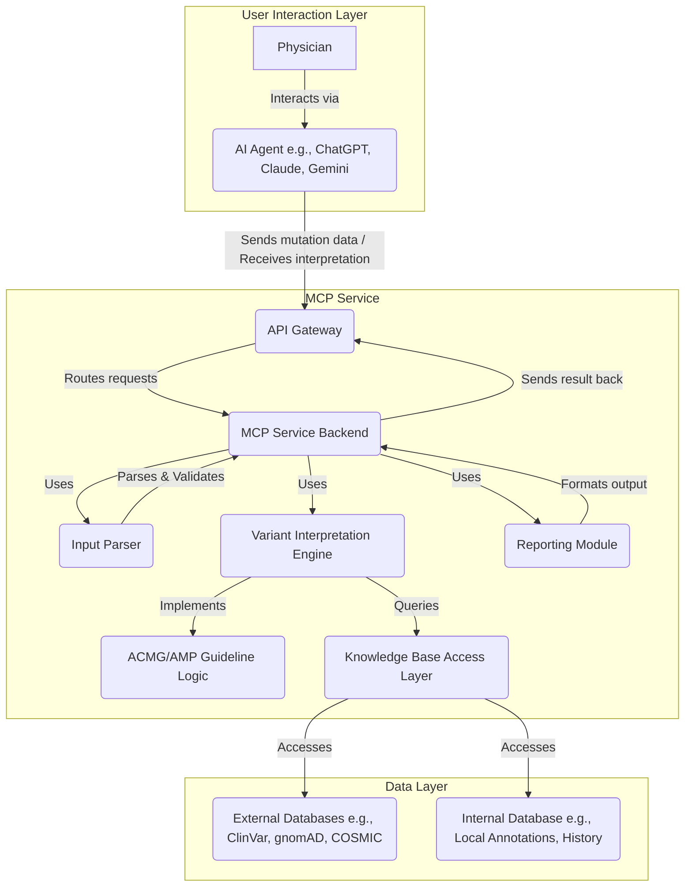

# MCP Service: AI-Powered Variant Interpretation Assistant

**(Project Status: Active Development - Database Layer Complete)**

## Overview

The Medical Classification Platform (MCP) Service is a backend system designed to assist physicians, clinical geneticists, and researchers in interpreting somatic and germline genetic variants. It leverages the standardized **ACMG/AMP guidelines** for variant classification to provide consistent and evidence-based interpretations.

A key feature of this service is its designed integration capability with popular large language model (LLM) based AI agents such as **ChatGPT, Claude, and Gemini**. This allows clinicians to interact with the service using a natural language interface, simply providing the variant details and receiving the interpretation report back through the AI agent.

## Purpose

The goal of the MCP Service is to:

1.  Standardize the application of ACMG/AMP guidelines for variant interpretation.
2.  Reduce the manual effort and time required for evidence gathering and classification.
3.  Provide a seamless user experience for clinicians through integration with familiar AI tools.
4.  Facilitate accurate and reproducible variant classification in clinical and research settings.

## Implementation Status

### ✅ Completed Components
- **Database Layer**: PostgreSQL with pgx driver, connection pooling, and migrations
- **Repository Pattern**: Variant and interpretation data access with JSONB support
- **Domain Models**: Complete type definitions for variants, classifications, and rules
- **Database Schema**: Optimized tables with proper indexing for genomic queries
- **Integration Testing**: Test containers for isolated database testing

### 🚧 In Development
- **Input Parser**: HGVS notation validation and variant normalization
- **External API Integration**: ClinVar, gnomAD, and COSMIC client implementations
- **ACMG/AMP Rule Engine**: 28 evidence criteria implementation
- **HTTP API Layer**: REST endpoints with Gin framework

### 📋 Planned Features
- **Report Generation**: Structured clinical reports with recommendations
- **Caching Layer**: Redis integration for external API response caching
- **Authentication**: API key validation and rate limiting
- **Monitoring**: Comprehensive logging and metrics collection

## Features

* **ACMG/AMP Guideline Engine:** Implements the core logic for classifying variants based on evidence criteria.
* **Somatic & Germline Support:** Designed to handle both types of mutations (Note: Specific guideline sets like AMP/ASCO/CAP for somatic variants might require distinct implementation paths).
* **AI Agent Ready API:** A defined API layer allows straightforward integration with platforms like ChatGPT, Claude, Gemini, etc.
* **Evidence Aggregation:** Connects to essential public databases (e.g., ClinVar, gnomAD, COSMIC) and potentially internal institutional databases.
* **Structured Reporting:** Outputs clear classification results (Pathogenic, Likely Pathogenic, VUS, Likely Benign, Benign) along with the specific ACMG/AMP evidence codes met.
* **Clinical Database**: PostgreSQL-based storage with full audit trails and JSONB support for flexible evidence storage.

## Architecture

The service follows a modular microservice-oriented architecture:

* **API Gateway:** Entry point for requests from AI agents.
* **MCP Service Backend:** Orchestrates the interpretation workflow.
* **Input Parser:** Validates and standardizes variant nomenclature.
* **Variant Interpretation Engine:** Applies guideline logic using aggregated evidence.
* **Knowledge Base Access:** Interfaces with various data sources.
* **Reporting Module:** Formats the final interpretation output.



## Target Audience

* Clinical Geneticists
* Molecular Pathologists
* Oncologists
* Genetic Counselors
* Bioinformaticians
* Medical Researchers

## Project Structure

```
/
├── cmd/                    # Main applications
│   └── server/            # HTTP server entry point
├── internal/              # Private application code
│   ├── api/              # HTTP handlers and routing
│   ├── config/           # Configuration management
│   ├── domain/           # Business logic and entities
│   ├── repository/       # Data access layer
│   └── service/          # Application services
├── pkg/                  # Public library code
│   ├── acmg/            # ACMG/AMP rule engine
│   ├── hgvs/            # HGVS parsing utilities
│   └── external/        # External API clients
├── api/                 # OpenAPI/Swagger specs
├── migrations/          # Database migrations
├── docker/             # Docker configurations
├── docs/               # Documentation
└── config.example.yaml # Example configuration
```

## Core Interfaces

The service is built around well-defined interfaces:

- **APIGateway**: HTTP request handling and coordination
- **InputParser**: HGVS validation and variant standardization  
- **InterpretationEngine**: ACMG/AMP rule application and classification
- **KnowledgeBaseAccess**: External database integration
- **ReportGenerator**: Structured report generation

## Getting Started

### Prerequisites
- Go 1.21+
- PostgreSQL 15+
- Redis 7+ (for caching)

### Quick Start with Docker

1. **Clone the repository**
   ```bash
   git clone <repository-url>
   cd acmg-amp-mcp-server
   ```

2. **Set up environment variables (IMPORTANT)**
   ```bash
   cp .env.example .env
   # Edit .env with your actual values - NEVER commit this file!
   ```

3. **Copy configuration**
   ```bash
   cp config.example.yaml config.yaml
   # Configuration will automatically use environment variables
   ```

4. **Run with Docker Compose**
   ```bash
   # Development (uses .env file)
   docker-compose up -d
   
   # Production (uses Docker secrets - recommended)
   ./scripts/setup-secrets.sh
   docker-compose -f docker-compose.prod.yml up -d
   ```

5. **Run database migrations**
   ```bash
   # Migrations are automatically applied on startup
   # Or run manually: go run cmd/migrate/main.go up
   ```

6. **Check health**
   ```bash
   curl http://localhost:8080/health
   ```

### Security Notice

⚠️ **This is medical software handling genetic data. Security is critical:**

- Never commit `.env` files or secrets to version control
- Use strong, unique passwords for all services
- Enable TLS/HTTPS in production environments
- Regularly rotate API keys and database passwords
- Monitor audit logs for suspicious activity
- See [SECURITY.md](SECURITY.md) for complete security guidelines

### Local Development

```bash
# Install dependencies
go mod download

# Set up local PostgreSQL database
createdb acmg_amp_dev

# Copy and configure environment
cp config.example.yaml config.yaml
# Edit database connection settings

# Run database migrations
go run cmd/migrate/main.go up

# Run the server
go run cmd/server/main.go

# Run tests (requires test database)
go test ./...
```

## Configuration

The service uses Viper for configuration management with support for:
- YAML configuration files
- Environment variables (prefixed with `ACMG_AMP_`)
- Sensible defaults for development

Key configuration sections:
- **Server**: HTTP server settings (port, timeouts, CORS)
- **Database**: PostgreSQL connection settings with connection pooling
- **Redis**: Cache configuration for external API responses
- **External**: API keys and settings for ClinVar, gnomAD, COSMIC
- **Logging**: Structured logging with configurable levels

### Database Configuration

The service requires PostgreSQL 15+ with the following features:
- UUID generation (`gen_random_uuid()`)
- JSONB support for storing evidence and rule data
- Full-text search capabilities for variant queries
- Connection pooling for optimal performance

### Database Schema

The system uses two main tables:
- **variants**: Stores genetic variant information with HGVS notation
- **interpretations**: Stores classification results with ACMG/AMP rule applications

Database migrations are managed automatically and include:
- Proper indexing for genomic coordinates and gene symbols
- JSONB indexes for efficient rule and evidence queries
- Audit timestamps with automatic updates

## API Endpoints

### Health and Status
- `GET /health` - Service health check with database connectivity
- `GET /metrics` - Prometheus metrics endpoint
- `GET /version` - Service version information

### Variant Management
- `POST /api/v1/variants` - Create or retrieve variant by HGVS
- `GET /api/v1/variants/:id` - Get variant details by UUID
- `GET /api/v1/variants/hgvs/:notation` - Get variant by HGVS notation
- `GET /api/v1/variants/gene/:symbol` - List variants by gene symbol

### Interpretation Services
- `POST /api/v1/interpret` - Perform variant interpretation with ACMG/AMP rules
- `GET /api/v1/interpretations/:id` - Get interpretation results by UUID
- `GET /api/v1/interpretations/variant/:variant_id` - Get interpretations for a variant
- `GET /api/v1/interpretations/classification/:type` - Filter by classification type

### Request/Response Format

#### Variant Interpretation Request
```json
{
  "hgvs": "NC_000017.11:g.43094692G>A",
  "gene_symbol": "BRCA1",
  "transcript": "NM_007294.4",
  "client_id": "clinical_lab_001",
  "request_id": "req_12345",
  "metadata": {
    "patient_age": "45",
    "indication": "breast_cancer_risk"
  }
}
```

#### Interpretation Response
```json
{
  "request_id": "req_12345",
  "variant": {
    "id": "uuid-here",
    "hgvs_genomic": "NC_000017.11:g.43094692G>A",
    "chromosome": "17",
    "position": 43094692,
    "gene_symbol": "BRCA1",
    "variant_type": "GERMLINE"
  },
  "classification": "PATHOGENIC",
  "confidence": "HIGH",
  "report": {
    "applied_rules": [
      {
        "code": "PVS1",
        "category": "PATHOGENIC",
        "strength": "VERY_STRONG",
        "met": true,
        "evidence": "Null variant in critical domain",
        "rationale": "Frameshift variant in BRCA1 exon 11"
      }
    ],
    "summary": "This variant is classified as Pathogenic based on strong evidence...",
    "recommendations": ["Genetic counseling recommended", "Consider cascade testing"]
  },
  "processing_time": "1.2s",
  "processed_at": "2025-01-19T10:30:00Z"
}
```

## Licensing

**License Grant:** The licensor grants you a license to use, copy, and modify the software **strictly for Non-Commercial Use**.

**Non-Commercial Use Definition:** "Non-Commercial Use" means usage for purposes that do not involve generating revenue, promoting a commercial enterprise, or forming part of a service offered for a fee. This includes academic research, teaching, personal experimentation, and use within a non-profit organization for internal research purposes not directly tied to paid services.

**Commercial Use Restriction:** Any use of this software for "Commercial Use" is **strictly prohibited** without obtaining a separate, written commercial license agreement from the licensor and paying the applicable license fees. "Commercial Use" includes, but is not limited to:
    * Integrating the software or its components into a product or service offered for sale or license.
    * Using the software to provide paid consulting, analysis, or reporting services.
    * Using the software within a for-profit organization for routine operations that generate revenue.
    * Distributing the software bundled with commercial offerings.

**Source Code Availability:** While the source code may be made available, this availability does not grant any rights for Commercial Use. All rights not expressly granted for Non-Commercial Use are reserved by the licensor.

**Disclaimer:** This license text is provided for informational purposes. It is strongly recommended to consult with legal counsel to draft a formal and enforceable license agreement that accurately reflects these terms.

## Contact for Commercial Licensing

If you wish to use the MCP Service for commercial purposes, please contact:

**[Yi John Huang]**
**[yi.john.huang@me.com]**

---
*This README was generated on: 2025-04-12*