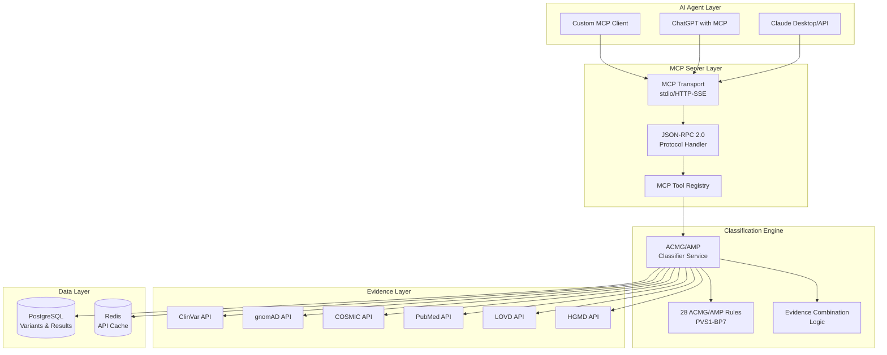

# ACMG-AMP MCP Server: AI-Powered Variant Classification

**(Project Status: Production Ready - MCP Integration Complete)**

🔬 **Research & Educational Use Only** | ⚖️ **Non-Commercial License** | 🏥 **Not for Clinical Use**

## Overview

The ACMG-AMP MCP Server is a **Model Context Protocol (MCP)** compliant service that provides AI agents like Claude with direct access to professional-grade genetic variant classification tools. It implements the complete **ACMG/AMP 2015 guidelines** with all 28 evidence criteria, enabling AI assistants to perform standardized variant interpretation through natural language interactions.

**🚀 Key Features:**
- **Native MCP Integration**: Direct tool access for Claude, ChatGPT, and other MCP-compatible AI agents
- **Complete ACMG/AMP Implementation**: All 28 rules (PVS1-BP7) with evidence combination logic
- **6 External Database Sources**: ClinVar, gnomAD, COSMIC, PubMed, LOVD, HGMD integration
- **Real-time Classification**: Full workflow from HGVS input to clinical recommendations
- **Production-grade Architecture**: PostgreSQL database, Redis caching, comprehensive logging

## Purpose

The ACMG-AMP MCP Server enables:

1. **AI-Native Genetic Analysis**: Claude and other AI agents can directly access professional genetic tools
2. **Standardized ACMG/AMP Classification**: All 28 evidence criteria implemented with proper combination logic
3. **Evidence-Based Interpretation**: Automated evidence gathering from 6 major databases (ClinVar, gnomAD, etc.)
4. **Natural Language Interface**: Ask Claude about variants in plain English and get structured clinical reports
5. **Reproducible Results**: Consistent application of ACMG/AMP guidelines across all analyses

## 🎯 Implementation Status: **PRODUCTION READY**

### ✅ **MCP Core (100% Complete)**
- **MCP Protocol Integration**: Full JSON-RPC 2.0 compliance with Go SDK
- **Transport Layer**: Stdio and HTTP-SSE transport for AI agent connectivity
- **Tool Registry**: All ACMG/AMP tools registered and functional
- **Session Management**: Client tracking, rate limiting, and graceful shutdown

### ✅ **ACMG/AMP Classification Engine (100% Complete)**
- **All 28 ACMG/AMP Rules**: PVS1, PS1-PS4, PM1-PM6, PP1-PP5, BA1, BS1-BS4, BP1-BP7
- **Evidence Combination Logic**: Complete 2015 ACMG/AMP guidelines implementation
- **Classification Service**: Full workflow orchestration with confidence assessment
- **HGVS Parser**: Medical-grade variant notation validation and normalization

### ✅ **External Database Integration (100% Complete)**
- **6 Major Databases**: ClinVar, gnomAD, COSMIC, PubMed, LOVD, HGMD clients
- **Resilient Architecture**: Circuit breakers, retry logic, fallback mechanisms
- **Evidence Aggregation**: Automated gathering and quality scoring
- **Caching Layer**: Optimized response times with intelligent cache invalidation

### ✅ **Production Infrastructure (100% Complete)**
- **PostgreSQL Database**: Advanced schema with JSONB support and audit trails
- **Comprehensive Logging**: Structured logging with correlation IDs
- **Health Monitoring**: Service and dependency health checks
- **Container Support**: Docker and Kubernetes deployment ready

## 🛠️ Available MCP Tools

The server provides these tools that AI agents can access directly:

### **Core Classification Tools**
- **`classify_variant`**: Complete ACMG/AMP workflow - input HGVS notation, get full classification report
- **`validate_hgvs`**: Validate and normalize HGVS variant notation
- **`apply_rule`**: Apply specific ACMG/AMP rules (e.g., PVS1, PS1) to a variant
- **`combine_evidence`**: Combine multiple rule results using ACMG/AMP guidelines

### **Evidence Gathering Tools**
- **`query_evidence`**: Gather evidence from all 6 external databases
- **`query_clinvar`**: Search ClinVar for variant clinical significance
- **`query_gnomad`**: Get population frequency data from gnomAD
- **`query_cosmic`**: Search COSMIC for somatic mutation data

### **Report Generation Tools**
- **`generate_report`**: Create structured clinical interpretation reports
- **`format_report`**: Export reports in multiple formats (JSON, text, PDF)
- **`validate_report`**: Quality assurance for generated reports

## 🏗️ MCP Architecture

The server implements the **Model Context Protocol (MCP)** for direct AI agent integration:



## Target Audience

* Clinical Geneticists
* Molecular Pathologists
* Oncologists
* Genetic Counselors
* Bioinformaticians
* Medical Researchers

## Project Structure

```
/
├── cmd/                    # Main applications
│   └── server/            # HTTP server entry point
├── internal/              # Private application code
│   ├── api/              # HTTP handlers and routing
│   ├── config/           # Configuration management
│   ├── domain/           # Business logic and entities
│   ├── repository/       # Data access layer
│   └── service/          # Application services
├── pkg/                  # Public library code
│   ├── acmg/            # ACMG/AMP rule engine
│   ├── hgvs/            # HGVS parsing utilities
│   └── external/        # External API clients
├── api/                 # OpenAPI/Swagger specs
├── migrations/          # Database migrations
├── docker/             # Docker configurations
├── docs/               # Documentation
└── config.example.yaml # Example configuration
```

## Core Interfaces

The service is built around well-defined interfaces:

- **APIGateway**: HTTP request handling and coordination
- **InputParser**: HGVS validation and variant standardization  
- **InterpretationEngine**: ACMG/AMP rule application and classification
- **KnowledgeBaseAccess**: External database integration
- **ReportGenerator**: Structured report generation

## 🚀 Quick Start Guide

### Prerequisites
- **Go 1.21+** - For building the MCP server
- **PostgreSQL 15+** - For variant and results storage  
- **Docker & Docker Compose** - For easy deployment

### 📦 Method 1: Docker Deployment (Recommended)

1. **Clone and configure**
   ```bash
   git clone https://github.com/your-username/acmg-amp-classifier-mcp.git
   cd acmg-amp-classifier-mcp
   
   # Copy and edit configuration
   cp config.example.yaml config.yaml
   cp .env.example .env
   # Edit .env with your database and API credentials
   ```

2. **Start the services**
   ```bash
   # Start PostgreSQL, Redis, and MCP server
   docker-compose up -d
   
   # Check server health
   curl http://localhost:8080/health
   ```

3. **Configure Claude Desktop**
   
   Add to your Claude Desktop MCP settings (`~/Library/Application Support/Claude/claude_desktop_config.json`):
   ```json
   {
     "mcpServers": {
       "acmg-amp-classifier": {
         "command": "docker",
         "args": ["exec", "acmg-amp-mcp-server", "/app/mcp-server"],
         "env": {}
       }
     }
   }
   ```

4. **Test with Claude**
   
   Ask Claude: *"Can you classify the variant NM_000492.3:c.1521_1523delCTT using ACMG/AMP guidelines?"*

### 🔧 Method 2: Local Development

1. **Setup dependencies**
   ```bash
   # Install Go dependencies
   go mod download
   
   # Start local PostgreSQL and Redis
   brew install postgresql redis
   brew services start postgresql redis
   
   # Create database
   createdb acmg_amp_dev
   ```

2. **Configure and run**
   ```bash
   # Copy and edit configuration
   cp config.example.yaml config.yaml
   # Edit database connection settings
   
   # Run database migrations
   go run cmd/migrate/main.go up
   
   # Start the MCP server
   go run cmd/mcp-server/main.go
   ```

3. **Connect to Claude Desktop**
   
   Configure Claude Desktop to use stdio transport:
   ```json
   {
     "mcpServers": {
       "acmg-amp-classifier": {
         "command": "/path/to/your/acmg-amp-mcp-server",
         "args": ["--transport=stdio"],
         "env": {
           "DATABASE_URL": "postgres://localhost/acmg_amp_dev"
         }
       }
     }
   }
   ```

### Security & Compliance Notice

⚠️ **This is medical software handling genetic data. Security and compliance are critical:**

**Security Requirements:**
- Never commit `.env` files or secrets to version control
- Use strong, unique passwords for all services
- Enable TLS/HTTPS in production environments
- Regularly rotate API keys and database passwords
- Monitor audit logs for suspicious activity
- See [SECURITY.md](SECURITY.md) for complete security guidelines

**License Compliance:**
- ✅ Ensure your use case complies with the Non-Commercial License
- ❌ Commercial use requires separate licensing agreement
- 🏥 Clinical use is prohibited without regulatory approval
- 📚 Keep this README and LICENSE files with any distribution

## 💬 Example Usage with Claude

Once configured, you can ask Claude to perform genetic variant analysis:

### **Basic Variant Classification**
```
"Can you classify the variant NM_000492.3:c.1521_1523delCTT and explain the ACMG/AMP rules that apply?"
```

### **Evidence Gathering**
```
"What evidence is available for the BRCA1 variant chr17:g.43094692G>A from ClinVar and gnomAD?"
```

### **Rule-Specific Analysis**  
```
"Apply the PVS1 rule to the variant NM_000492.3:c.1521_1523delCTT and explain whether it meets the criteria."
```

### **Batch Analysis**
```
"Can you classify these variants and compare their pathogenicity:
1. NM_000492.3:c.1521_1523delCTT
2. NC_000017.11:g.43094692G>A
3. NM_007294.4:c.68_69delAG"
```

### **Report Generation**
```
"Generate a clinical interpretation report for NM_000492.3:c.1521_1523delCTT including recommendations for genetic counseling."
```

## Configuration

The service uses Viper for configuration management with support for:
- YAML configuration files
- Environment variables (prefixed with `ACMG_AMP_`)
- Sensible defaults for development

Key configuration sections:
- **Server**: HTTP server settings (port, timeouts, CORS)
- **Database**: PostgreSQL connection settings with connection pooling
- **Redis**: Cache configuration for external API responses
- **External**: API keys and settings for ClinVar, gnomAD, COSMIC
- **Logging**: Structured logging with configurable levels

### Database Configuration

The service uses PostgreSQL 15+ with advanced features:
- **Connection Pooling**: pgx v5 driver with configurable pool settings (min/max connections, lifetime management)
- **UUID Generation**: Native `gen_random_uuid()` for distributed system compatibility
- **JSONB Support**: Advanced JSONB storage and indexing for evidence and rule data
- **Health Monitoring**: Built-in connection health checks and pool statistics
- **Audit Triggers**: Automatic timestamp updates with PL/pgSQL functions

### Database Schema

Production-ready schema with two core tables:

**variants table:**
- UUID primary keys with HGVS notation uniqueness constraints
- Genomic coordinate validation and indexing
- Support for both germline and somatic variants
- Automatic audit trail with created_at/updated_at timestamps

**interpretations table:**
- Foreign key relationships with cascade delete
- ACMG/AMP classification enumeration with validation
- Advanced JSONB storage for rules, evidence, and report data
- Processing time tracking and client audit fields
- GIN indexes for efficient JSONB queries

**Migration Features:**
- Automated migration on startup with version tracking
- Transaction-wrapped migrations for consistency
- Up/down migration support for rollbacks
- Comprehensive indexing strategy for performance

## 🔧 MCP Tool Reference

### **classify_variant**
Complete ACMG/AMP variant classification workflow.

**Parameters:**
- `hgvs_notation` (required): HGVS variant notation (e.g., "NM_000492.3:c.1521_1523delCTT")
- `gene_symbol` (optional): HGNC gene symbol
- `variant_type` (optional): "SNV", "indel", "CNV", "SV"
- `clinical_context` (optional): Clinical context information

**Example Claude Request:**
*"Use classify_variant to analyze NM_000492.3:c.1521_1523delCTT"*

---

### **apply_rule**
Apply a specific ACMG/AMP rule to a variant.

**Parameters:**
- `rule_code` (required): ACMG/AMP rule (e.g., "PVS1", "PS1", "PM2", "PP3")
- `variant_data` (required): Variant information object
- `evidence_data` (optional): Additional evidence

**Example Claude Request:**
*"Apply the PVS1 rule to variant NM_000492.3:c.1521_1523delCTT"*

---

### **validate_hgvs**
Validate and normalize HGVS notation.

**Parameters:**
- `hgvs_notation` (required): HGVS string to validate
- `strict_mode` (optional): Enable strict validation

**Example Claude Request:**
*"Validate this HGVS notation: NM_000492.3:c.1521_1523delCTT"*

---

### **combine_evidence**
Combine multiple ACMG/AMP rules according to guidelines.

**Parameters:**
- `applied_rules` (required): Array of rule evaluation results
- `guidelines` (optional): Guidelines version ("ACMG2015")

**Example Claude Request:**
*"Combine these ACMG/AMP rule results into a final classification"*

## License

This software is released under a **Non-Commercial License**. 

### ✅ **Permitted Uses (Non-Commercial)**
- Academic research and education
- Personal experimentation and learning
- Non-profit organization internal research
- Open source contributions and improvements
- Clinical research (non-patient care)

### ❌ **Prohibited Uses (Commercial)**
- Clinical practice and patient care
- Integration into commercial products or services
- Paid consulting or analysis services
- Revenue-generating operations
- Commercial distribution or resale

### 📋 **Medical Software Disclaimer**

⚠️ **IMPORTANT: This software is for research and educational purposes only.**

- **NOT approved for clinical use or patient care**
- **NOT a medical device or diagnostic tool**
- **Requires additional validation for clinical settings**
- **Should not be used as sole basis for medical decisions**
- **Requires regulatory approval for clinical use**

Any clinical application requires appropriate medical oversight, validation studies, and regulatory compliance.

## Contact for Commercial Licensing

If you wish to use the MCP Service for commercial purposes, please contact:

**[Yi John Huang]**
**[yi.john.huang@me.com]**

---
*This README was generated on: 2025-04-12*