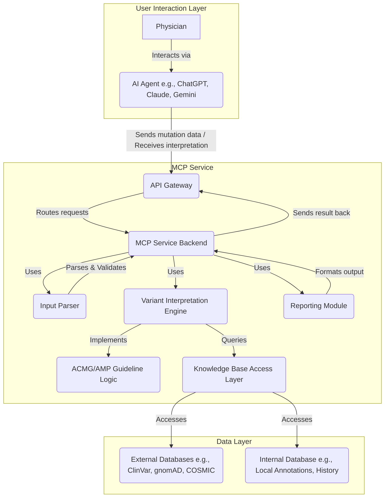

# MCP Service: AI-Powered Variant Interpretation Assistant

**(Project Status: Concept / In Development)**

## Overview

The Medical Classification Platform (MCP) Service is a backend system designed to assist physicians, clinical geneticists, and researchers in interpreting somatic and germline genetic variants. It leverages the standardized **ACMG/AMP guidelines** for variant classification to provide consistent and evidence-based interpretations.

A key feature of this service is its designed integration capability with popular large language model (LLM) based AI agents such as **ChatGPT, Claude, and Gemini**. This allows clinicians to interact with the service using a natural language interface, simply providing the variant details and receiving the interpretation report back through the AI agent.

## Purpose

The goal of the MCP Service is to:

1.  Standardize the application of ACMG/AMP guidelines for variant interpretation.
2.  Reduce the manual effort and time required for evidence gathering and classification.
3.  Provide a seamless user experience for clinicians through integration with familiar AI tools.
4.  Facilitate accurate and reproducible variant classification in clinical and research settings.

## Features

* **ACMG/AMP Guideline Engine:** Implements the core logic for classifying variants based on evidence criteria.
* **Somatic & Germline Support:** Designed to handle both types of mutations (Note: Specific guideline sets like AMP/ASCO/CAP for somatic variants might require distinct implementation paths).
* **AI Agent Ready API:** A defined API layer allows straightforward integration with platforms like ChatGPT, Claude, Gemini, etc.
* **Evidence Aggregation:** Connects to essential public databases (e.g., ClinVar, gnomAD, COSMIC) and potentially internal institutional databases.
* **Structured Reporting:** Outputs clear classification results (Pathogenic, Likely Pathogenic, VUS, Likely Benign, Benign) along with the specific ACMG/AMP evidence codes met.

## Architecture

The service follows a modular microservice-oriented architecture:

* **API Gateway:** Entry point for requests from AI agents.
* **MCP Service Backend:** Orchestrates the interpretation workflow.
* **Input Parser:** Validates and standardizes variant nomenclature.
* **Variant Interpretation Engine:** Applies guideline logic using aggregated evidence.
* **Knowledge Base Access:** Interfaces with various data sources.
* **Reporting Module:** Formats the final interpretation output.



## Target Audience

* Clinical Geneticists
* Molecular Pathologists
* Oncologists
* Genetic Counselors
* Bioinformaticians
* Medical Researchers

## Project Structure

```
/
├── cmd/                    # Main applications
│   └── server/            # HTTP server entry point
├── internal/              # Private application code
│   ├── api/              # HTTP handlers and routing
│   ├── config/           # Configuration management
│   ├── domain/           # Business logic and entities
│   ├── repository/       # Data access layer
│   └── service/          # Application services
├── pkg/                  # Public library code
│   ├── acmg/            # ACMG/AMP rule engine
│   ├── hgvs/            # HGVS parsing utilities
│   └── external/        # External API clients
├── api/                 # OpenAPI/Swagger specs
├── migrations/          # Database migrations
├── docker/             # Docker configurations
├── docs/               # Documentation
└── config.example.yaml # Example configuration
```

## Core Interfaces

The service is built around well-defined interfaces:

- **APIGateway**: HTTP request handling and coordination
- **InputParser**: HGVS validation and variant standardization  
- **InterpretationEngine**: ACMG/AMP rule application and classification
- **KnowledgeBaseAccess**: External database integration
- **ReportGenerator**: Structured report generation

## Getting Started

### Prerequisites
- Go 1.21+
- PostgreSQL 15+
- Redis 7+

### Quick Start with Docker

1. **Clone the repository**
   ```bash
   git clone <repository-url>
   cd acmg-amp-mcp-server
   ```

2. **Copy configuration**
   ```bash
   cp config.example.yaml config.yaml
   # Edit config.yaml with your database and API settings
   ```

3. **Run with Docker Compose**
   ```bash
   docker-compose up -d
   ```

4. **Check health**
   ```bash
   curl http://localhost:8080/health
   ```

### Local Development

```bash
# Install dependencies
go mod download

# Run the server
go run cmd/server/main.go

# Run tests
go test ./...
```

## Configuration

The service uses Viper for configuration management with support for:
- YAML configuration files
- Environment variables (prefixed with `ACMG_AMP_`)
- Sensible defaults for development

Key configuration sections:
- **Server**: HTTP server settings
- **Database**: PostgreSQL connection settings  
- **Redis**: Cache configuration
- **External**: API keys and settings for ClinVar, gnomAD, COSMIC
- **Logging**: Log level and format settings

## API Endpoints

- `GET /health` - Health check
- `POST /api/v1/interpret` - Variant interpretation
- `GET /api/v1/variant/:id` - Get variant details
- `GET /api/v1/interpretation/:id` - Get interpretation results

## Licensing

**License Grant:** The licensor grants you a license to use, copy, and modify the software **strictly for Non-Commercial Use**.

**Non-Commercial Use Definition:** "Non-Commercial Use" means usage for purposes that do not involve generating revenue, promoting a commercial enterprise, or forming part of a service offered for a fee. This includes academic research, teaching, personal experimentation, and use within a non-profit organization for internal research purposes not directly tied to paid services.

**Commercial Use Restriction:** Any use of this software for "Commercial Use" is **strictly prohibited** without obtaining a separate, written commercial license agreement from the licensor and paying the applicable license fees. "Commercial Use" includes, but is not limited to:
    * Integrating the software or its components into a product or service offered for sale or license.
    * Using the software to provide paid consulting, analysis, or reporting services.
    * Using the software within a for-profit organization for routine operations that generate revenue.
    * Distributing the software bundled with commercial offerings.

**Source Code Availability:** While the source code may be made available, this availability does not grant any rights for Commercial Use. All rights not expressly granted for Non-Commercial Use are reserved by the licensor.

**Disclaimer:** This license text is provided for informational purposes. It is strongly recommended to consult with legal counsel to draft a formal and enforceable license agreement that accurately reflects these terms.

## Contact for Commercial Licensing

If you wish to use the MCP Service for commercial purposes, please contact:

**[Yi John Huang]**
**[yi.john.huang@me.com]**

---
*This README was generated on: 2025-04-12*