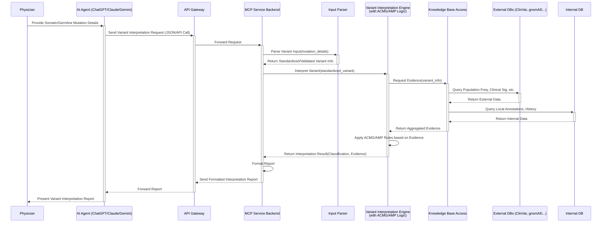

```mermaid
sequenceDiagram
    participant User as Physician
    participant AI_Agent as AI Agent (ChatGPT/Claude/Gemini)
    participant API_GW as API Gateway
    participant MCP_BE as MCP Service Backend
    participant Parser as Input Parser
    participant Engine as Variant Interpretation Engine <br/>(with ACMG/AMP Logic)
    participant KB_Access as Knowledge Base Access
    participant Ext_DBs as External DBs (ClinVar, gnomAD...)
    participant Int_DB as Internal DB

    User->>+AI_Agent: Provide Somatic/Germline Mutation Details
    AI_Agent->>+API_GW: Send Variant Interpretation Request (JSON/API Call)
    API_GW->>+MCP_BE: Forward Request
    MCP_BE->>+Parser: Parse Variant Input(mutation_details)
    Parser-->>-MCP_BE: Return Standardized/Validated Variant Info
    MCP_BE->>+Engine: Interpret Variant(standardized_variant)
    Engine->>+KB_Access: Request Evidence(variant_info)
    KB_Access->>+Ext_DBs: Query Population Freq, Clinical Sig, etc.
    Ext_DBs-->>-KB_Access: Return External Data
    KB_Access->>+Int_DB: Query Local Annotations, History
    Int_DB-->>-KB_Access: Return Internal Data
    KB_Access-->>-Engine: Return Aggregated Evidence
    Engine->>Engine: Apply ACMG/AMP Rules based on Evidence
    Engine-->>-MCP_BE: Return Interpretation Result(Classification, Evidence)
    MCP_BE->>MCP_BE: Format Report
    MCP_BE-->>-API_GW: Send Formatted Interpretation Report
    API_GW-->>-AI_Agent: Forward Report
    AI_Agent-->>-User: Present Variant Interpretation Report
```