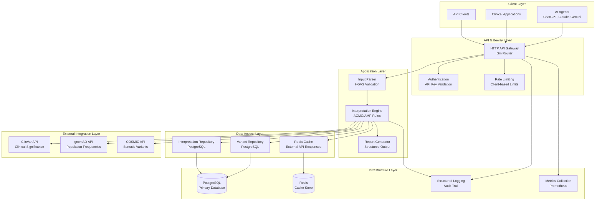
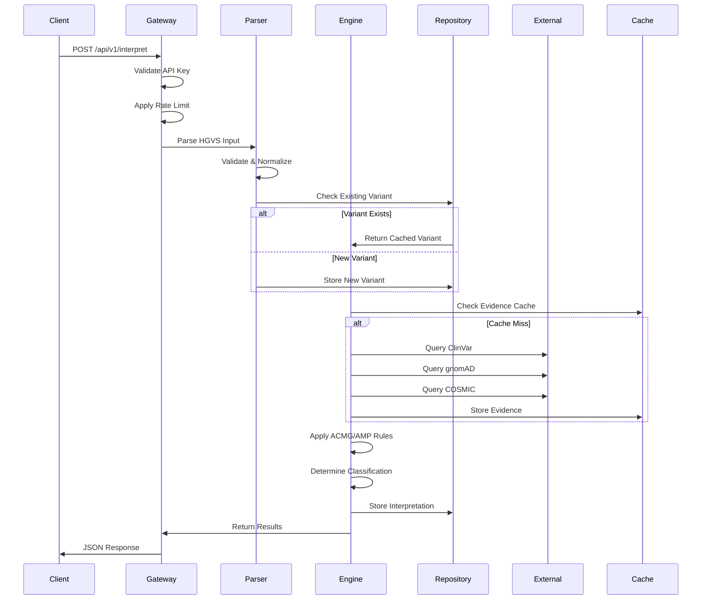

# System Architecture

## Overview

The ACMG/AMP MCP Server is designed as a microservice-oriented system that provides genetic variant interpretation services following clinical guidelines. The architecture emphasizes reliability, scalability, and clinical accuracy.

## High-Level Architecture



## Component Architecture

### 1. API Gateway Layer

#### HTTP Server (Gin Framework)
- **Purpose**: Handle HTTP requests and route to appropriate handlers
- **Features**: 
  - CORS support for web clients
  - Request/response logging with correlation IDs
  - Graceful shutdown handling
  - Health check endpoints

#### Authentication & Authorization
- **API Key Validation**: Client identification and access control
- **Rate Limiting**: Per-client request throttling
- **Request Validation**: Input sanitization and validation

### 2. Application Core

#### Input Parser
```go
type InputParser interface {
    ParseVariant(input string) (*StandardizedVariant, error)
    ValidateHGVS(hgvs string) error
    NormalizeVariant(variant *StandardizedVariant) error
}
```

**Responsibilities:**
- HGVS notation parsing and validation
- Variant normalization to standard format
- Gene symbol and transcript ID validation
- Error handling for malformed input

#### Interpretation Engine
```go
type InterpretationEngine interface {
    ClassifyVariant(ctx context.Context, variant *StandardizedVariant, evidence *AggregatedEvidence) (*ClassificationResult, error)
    ApplyACMGAMPRules(evidence *AggregatedEvidence) (*RuleApplication, error)
    DetermineClassification(rules *RuleApplication) Classification
}
```

**Responsibilities:**
- ACMG/AMP rule application (28 evidence criteria)
- Evidence aggregation from multiple sources
- Classification determination logic
- Confidence scoring based on evidence strength

#### Report Generator
```go
type ReportGenerator interface {
    GenerateReport(result *ClassificationResult, variant *StandardizedVariant) (*InterpretationReport, error)
    FormatForAIAgent(report *InterpretationReport) (string, error)
    GeneratePDFReport(report *InterpretationReport) ([]byte, error)
}
```

**Responsibilities:**
- Structured report generation
- Clinical recommendation formatting
- Multiple output formats (JSON, PDF, AI-friendly text)
- Evidence summary compilation

### 3. Data Access Layer

#### Repository Pattern Implementation

**Variant Repository:**
- Genetic variant CRUD operations
- HGVS-based queries
- Gene-based variant retrieval
- Genomic coordinate indexing

**Interpretation Repository:**
- Classification result storage
- JSONB handling for rules and evidence
- Audit trail maintenance
- Performance metrics tracking

#### Caching Strategy
- **Redis Integration**: External API response caching
- **TTL Management**: Configurable cache expiration
- **Cache Invalidation**: Smart cache refresh strategies
- **Fallback Handling**: Graceful degradation when cache unavailable

### 4. External Integration Layer

#### Database Clients

**ClinVar Integration:**
- Clinical significance data retrieval
- Expert-reviewed variant classifications
- Literature reference extraction
- Submission tracking

**gnomAD Integration:**
- Population frequency data
- Allele count information
- Ancestry-specific frequencies
- Quality metrics

**COSMIC Integration:**
- Somatic variant data
- Cancer-specific annotations
- Mutation signatures
- Tissue-specific information

#### Circuit Breaker Pattern
- **Failure Detection**: Automatic failure threshold monitoring
- **Fallback Mechanisms**: Graceful degradation strategies
- **Recovery Logic**: Automatic service restoration
- **Monitoring**: Real-time health status tracking

## Data Flow Architecture

### 1. Variant Interpretation Workflow



### 2. Data Persistence Strategy

**Write Operations:**
- Transactional integrity for related data
- Optimistic locking for concurrent updates
- Audit logging for all modifications
- Backup and recovery procedures

**Read Operations:**
- Connection pooling for performance
- Read replicas for scaling (future)
- Query optimization with proper indexing
- Caching for frequently accessed data

## Scalability Considerations

### Horizontal Scaling
- **Stateless Design**: No server-side session state
- **Database Connection Pooling**: Efficient resource utilization
- **Load Balancing**: Multiple service instances
- **Microservice Architecture**: Independent component scaling

### Performance Optimization
- **Caching Strategy**: Multi-level caching (Redis, in-memory)
- **Database Optimization**: Proper indexing and query optimization
- **Async Processing**: Background jobs for heavy operations
- **Connection Management**: Efficient database connection handling

### Monitoring and Observability
- **Structured Logging**: Comprehensive audit trails
- **Metrics Collection**: Performance and business metrics
- **Health Checks**: Service and dependency monitoring
- **Distributed Tracing**: Request flow tracking

## Security Architecture

### Data Protection
- **Encryption**: TLS for all communications
- **Input Validation**: Comprehensive input sanitization
- **SQL Injection Prevention**: Parameterized queries
- **Rate Limiting**: DDoS protection

### Clinical Compliance
- **HIPAA Considerations**: No PHI storage
- **Audit Requirements**: Complete operation logging
- **Data Retention**: Configurable retention policies
- **Access Control**: API key-based authentication

## Deployment Architecture

### Container Strategy
- **Docker Images**: Multi-stage builds for optimization
- **Health Checks**: Container health monitoring
- **Resource Limits**: Memory and CPU constraints
- **Graceful Shutdown**: Clean service termination

### Infrastructure Requirements
- **PostgreSQL 15+**: Primary database with JSONB support
- **Redis 7+**: Caching and session storage
- **Load Balancer**: Traffic distribution and SSL termination
- **Monitoring Stack**: Prometheus, Grafana, ELK

### Configuration Management
- **Environment Variables**: Runtime configuration
- **Config Files**: YAML-based configuration
- **Secrets Management**: Secure credential handling
- **Feature Flags**: Runtime behavior control

## Error Handling and Resilience

### Error Categories
- **Validation Errors**: Input format and content validation
- **External API Errors**: Third-party service failures
- **Database Errors**: Connection and query failures
- **System Errors**: Resource exhaustion and timeouts

### Resilience Patterns
- **Circuit Breaker**: External service failure protection
- **Retry Logic**: Exponential backoff for transient failures
- **Timeout Handling**: Request timeout management
- **Graceful Degradation**: Partial functionality during failures

### Recovery Strategies
- **Health Checks**: Automatic failure detection
- **Failover Mechanisms**: Service redundancy
- **Data Backup**: Regular database backups
- **Disaster Recovery**: Service restoration procedures