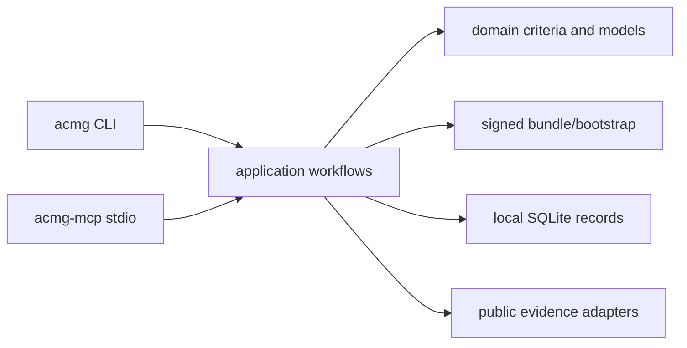

# Python application architecture

> **Research and educational use only. Not for clinical diagnostic use, patient
> care, or treatment decisions.**

The current implementation is a local Python package with explicit boundaries:

```mermaid
flowchart LR
    CLI[acmg CLI] --> App[application workflows]
    MCP[acmg-mcp stdio] --> App
    App --> Domain[domain criteria and models]
    App --> Bundle[signed bundle/bootstrap]
    App --> Store[local SQLite records]
    App --> Sources[public evidence adapters]
```

## Boundaries

- **Domain:** immutable models, rulesets, criterion evaluation, and combination;
  no CLI/MCP/database imports.
- **Application:** normalization, context resolution, evidence orchestration,
  drafts, replay, feedback, optional non-authoritative review, and workflow
  status.
- **Infrastructure:** SQLite state, signed bundles, source HTTP policy, public
  evidence adapters, and normalization providers.
- **Presentation:** Typer CLI, FastMCP stdio adapter, structured serialization,
  and opt-in legacy contract decisions.

CLI and MCP call the same application workflow. Optional specialist review can
advise a scientist but cannot modify the deterministic classification result.

## Default runtime

The package composes local application paths, SQLite state, and bootstrap logic
without a manually configured service or database. It intentionally has no
controlled release catalog/signing material in the wheel. Until a compatible
catalog and scientific runtime are supplied, classification returns a structured
`BUNDLE_UNAVAILABLE` state.

This architecture does not imply high availability, browser UI, institutional
authentication, clinical validation, or a hosted deployment. See
[capabilities](release/capabilities.md) and [known limits](known-limits.md).
